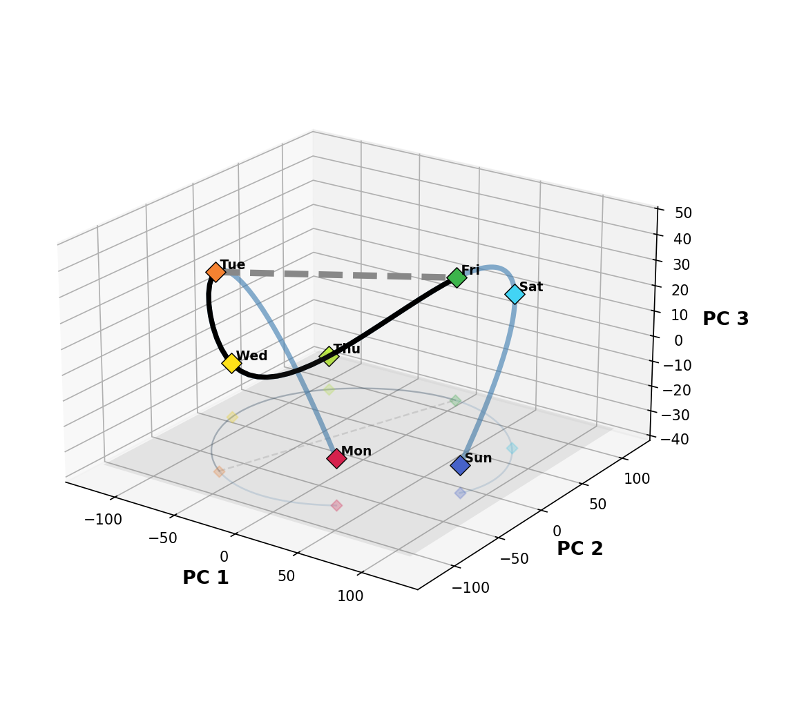
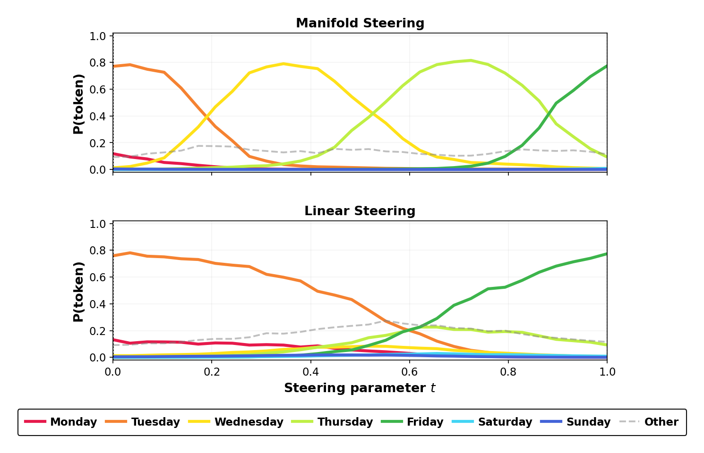

# Manifold Steering Replication

Replication of the main figure from **"Manifold Steering Reveals the Shared
Geometry of Neural Network Representation and Behavior"**
([Wurgaft et al., 2026](https://arxiv.org/abs/2605.05115)) on
**Gemma-2-2B**, plus an extension to two-dimensional concept structure
(a day × hour torus). Built as the final project for Stanford **CS 221M**
(Mechanistic Interpretability); the 2-page report is in
[`report/main.pdf`](report/main.pdf).

<p align="center">
  
  
</p>

**The claim.** Concept domains like weekdays trace smooth, cyclic manifolds in
both *activation space* (layer-24 hidden states) and *behavior space*
(Hellinger-embedded output distributions). Steering **along** the activation
manifold produces smooth, ordered behavioral transitions
(Tue → Wed → Thu → Fri); ordinary **linear** steering cuts off-manifold and
"teleports" probability mass.

## Reproduce from scratch

Requires a GPU (CUDA or Apple MPS) and access to the gated
[`google/gemma-2-2b-it`](https://huggingface.co/google/gemma-2-2b-it) weights
(`huggingface-cli login` or `export HF_TOKEN=...`).

```bash
git clone https://github.com/kirillacharya/manifold-steering-replication
cd manifold-steering-replication
uv sync                          # or: pip install -e .

bash slurm/run_all.sh            # full pipeline: collection → steering → figures
# on a SLURM cluster instead:  sbatch slurm/steering.sbatch
```

`run_all.sh` executes the five stages below in order (~20–30 min on an Apple
M-series laptop, a few minutes on a server GPU). Or run them individually:

```bash
# 1. Weekday + month activations and per-prompt output probabilities (layer 24)
uv run python scripts/run_weekdays.py --layer 24 --seed 0
uv run python scripts/run_months.py   --layer 24 --seed 0

# 2. Steering interventions (linear vs. manifold) for both domains
uv run python scripts/run_steering_probs.py --seed 0

# 3. Torus extension: 168 day×hour prompts → activations + subspaces
uv run python scripts/run_gemma_torus.py --layer 24 --acts-only --seed 0 \
    --acts-cache figures/gemma_torus/acts_2b_L24.pt
uv run python scripts/run_hierarchical_steering.py --seed 0

# 4. All figures (CPU-only, seconds)
uv run python scripts/plot_weekdays_separate.py
uv run python scripts/plot_months_separate.py
uv run python scripts/plot_probs_separate.py
uv run python scripts/render_torus_3d_L24.py
uv run python scripts/plot_subspace_hours.py
```

Collection scripts write their model outputs to `checkpoints/` and
`figures/*/` caches; the plotting scripts read only those files.

## Shortcut: figures without a GPU

The model outputs are small and committed, so if you only want to inspect or
rebuild the figures, skip collection entirely — step 4 above runs in seconds
on any laptop with no model download. The committed checkpoints are the
originals behind the report; re-running the full pipeline reproduces them
(see Reproducibility below).

## How it works

| Step | Script | What it does |
|---|---|---|
| Prompts → activations | `run_weekdays.py`, `run_months.py` | 42/72 arithmetic prompts ("Q: What day is two days after Monday? A:"), grouped by answer concept; records last-token layer-24 hidden state + output distribution per prompt |
| Manifold fitting | (inside plot/steering scripts) | Per-concept centroids → PCA (r=6 weekdays, r=11 months) → cubic spline through centroids in concept order; behavior manifold via Hellinger map p→√p first |
| Steering | `run_steering_probs.py` | 30 steps from source to target; a forward hook swaps the layer-24 last-token hidden state with the path point; linear path lerps raw centroids, manifold path sweeps the spline and decodes via PCA⁻¹ |
| Torus extension | `run_gemma_torus.py`, `run_hierarchical_steering.py` | 168 "It is HH:00 on {Day}" prompts; day/hour 2D subspaces by OLS on [sin θ, cos θ] labels (QR-orthogonalized); product-coordinate steering moves day and hour independently |
| Figures | `plot_*.py`, `render_torus_3d_L24.py` | Read from `checkpoints/` and `figures/*/` caches — no model needed |

**Practical note on layer choice:** patching layer 12 fails — keys/values from
the original prompt override the patch over the 14 remaining blocks. Layer 24
(92% depth, 2 blocks remaining) replicates cleanly.

## Repo map

```
scripts/        # collection + plotting (one experiment per file)
checkpoints/    # committed model outputs: per-prompt activations & steering probs
figures/        # generated figures + torus activation caches (.pt)
slurm/          # sbatch wrapper + generic run_all.sh
report/         # LaTeX source + built report.pdf (2-page walkthrough)
```

## Reproducibility

- The pipeline is fully deterministic: greedy forward passes (no sampling, no
  training), PCA, splines. Every collection script takes `--seed` as a guard.
- **Verified by full from-scratch re-execution**: with all checkpoints
  deleted, the complete pipeline (collection → steering → figures) was rerun
  through Gemma. The committed checkpoints and figures are that run's
  outputs. Within the same environment, re-runs reproduce model outputs
  bit-for-bit; across library versions, bfloat16 activations can drift by
  1 ulp (≤0.8% relative), which shifts curve positions by ~a pixel without
  changing any result.
- Model: `google/gemma-2-2b-it`, bfloat16 on GPU / float32 on CPU, 26 layers,
  d=2304. Report figures were produced at layer 24.

## Citation

```bibtex
@article{wurgaft2026manifold,
  title={Manifold Steering Reveals the Shared Geometry of Neural Network
         Representation and Behavior},
  author={Wurgaft, Daniel and Rager, Can and Kowal, Matthew and others},
  journal={arXiv preprint arXiv:2605.05115},
  year={2026}
}
```
